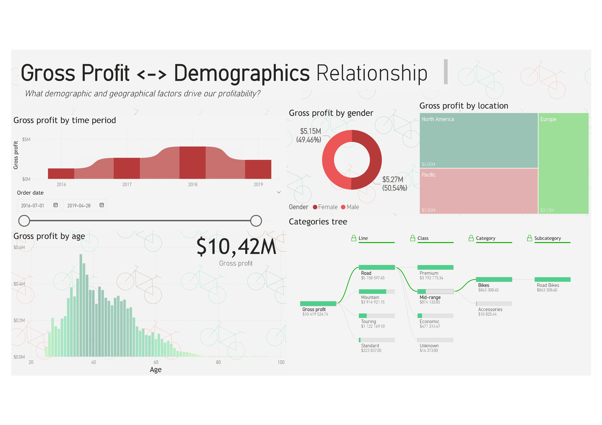
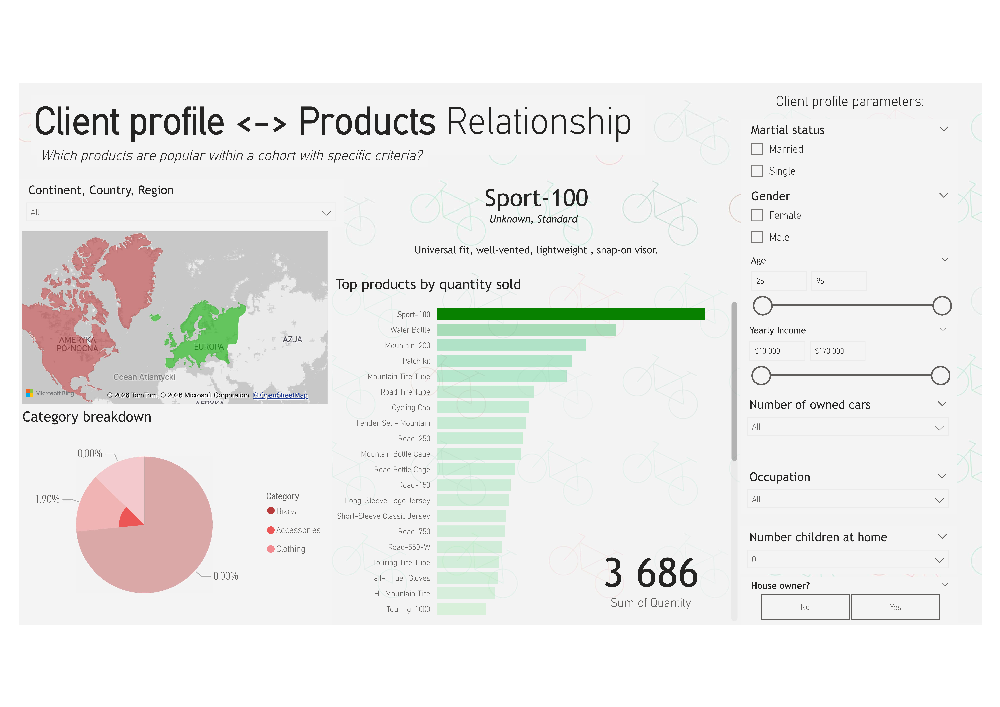

# Power BI AdventureWorks: GA4-Style Report 📊

This project is an interactive and responsive dashboard created in Power BI, based on the popular AdventureWorks dataset. It was designed with strong inspiration from the Google Analytics 4 (GA4) interface and analytical logic, allowing for intuitive exploration of user cohorts, demographic analysis, and tracking product performance.

## 🚀 About the Project

The main goal of this report is to transform raw sales data into clear, user-centric views (similar to how GA4 handles website traffic). Instead of standard tables, the report focuses on the relationships between customer characteristics, their purchasing behaviors, and the generated profit.

The report stands out with its clean, minimalist design (light background, subtle color accents) and advanced use of visualizations such as the Decomposition Tree and interactive filter panels.

## 📈 Main Views (Report Pages)

### 1. Gross Profit <-> Demographics Relationship
Answers the question: *What demographic and geographical factors drive our profitability?*

* **Gross profit by time period:** Area chart showing gross profit trends over time.
* **Demographic analysis:** Profit breakdown by gender (donut chart), age (histogram), and location (treemap divided by continents).
* **Categories tree:** Interactive decomposition tree allowing seamless navigation from overall profit ($10.42M) down to specific product lines, classes, categories, and subcategories (e.g., Bikes -> Road Bikes).

### 2. Client Profile <-> Products Relationship
Answers the question: *Which products are popular within a cohort with specific criteria?*

* **Advanced sidebar (Cohort filters):** Allows for deep customer segmentation based on marital status, gender, age, yearly income, number of cars owned, occupation, number of children, and homeownership.
* **Top products by quantity sold:** Dynamic ranking of best-selling products for the selected target group.
* **Product card:** Dynamically generated description and details (e.g., Line, Class, Features) for the most relevant product (e.g., Sport-100).
* **Geography and Categories:** Interactive map and pie chart for a quick overview of the sales structure.

## 🗄️ Data Model
The project utilizes an optimized Star Schema, which ensures high report performance and simplifies writing DAX measures.

* **Fact Table:** `Sales` (contains metrics like SalesAmount, Quantity, TotalProductCost, OrderDate).
* **Dimension Tables:** `Customers` (demographics), `dimProducts` (details and pricing), `dimProductSubCategory` (category hierarchy), and `dimTerritory` (geography).
* **Measures Table:** A dedicated `_Measures` table storing all DAX calculations (e.g., dynamic title cards, gross profit, sum of quantity).

## 🛠️ Technologies and Tools
* **Power BI Desktop:** Visualization, Modeling, Power Query.
* **DAX:** Creating measures, dynamic titles, and business logic.
* **CorelDraw:** Background.

## 📥 How to Run the Project?
1. Download the `Adventureworks PowerBi Cohort Analysis.pbix` file from this repository.
2. Open the file using the free Power BI Desktop application.
3. Explore the data! Use the right-hand panel on the "Client profile" tab to create your own cohorts and watch the charts update.
